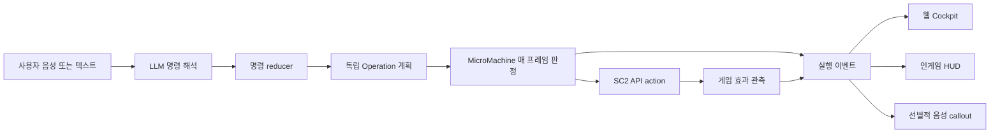
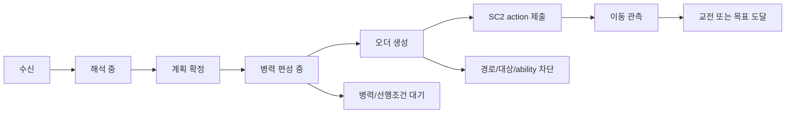
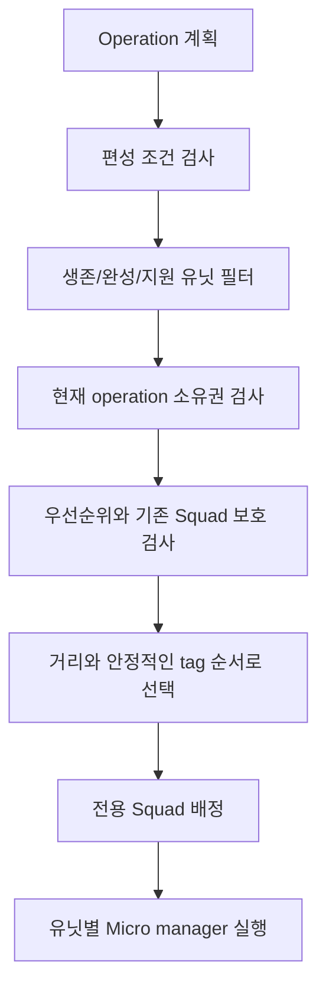
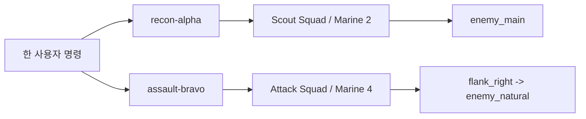
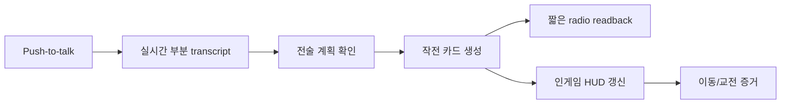

# Battlefield Command UX Design

> 최종 수정: 2026-07-29
> 목적: 사용자가 채팅 옆의 봇을 구경하는 것이 아니라, 실제 전장의 병력을
> 나누고 명령하고 결과를 확인한다는 감각을 제공한다.

## TL;DR

voiStarcraft2의 UX 대목표는 다음 한 문장이다.

> **내 명령이 어떤 병력에 배정되었고, 지금 어디까지 실행되었으며, 왜
> 멈췄는지를 웹과 게임 안에서 즉시 확인할 수 있어야 한다.**

현재 구현에는 독립 작전 ID, 병렬 스쿼드, 유닛 독점 소유권, 작전 카드,
실행 단계, 인게임 HUD와 SSE 기반 실시간 상태 갱신이 있다. 1초 폴링은 SSE
장애 때만 fallback으로 동작한다. 명시적 resize/reinforce/retarget/transfer는
같은 작전 카드의 새 generation으로 반영되고, 병력 변화와 충돌 해결 증거를
표시한다. 전술 음성 readback과 전장 지도 기반 작전 편집은 후속 구현
대상이다.

## 1. Capability Boundary

| 구분 | 책임 |
| --- | --- |
| 사용자 | 목표, 작전 종류, 병력 종류와 수, 경로, 목표 위치, 지속 조건, 우선순위를 지시한다. |
| LLM | 사용자 발화 시점의 게임 상태와 대화 맥락을 읽고 Macro / Operation / Micro / Emergency DSL로 해석한다. |
| 명령 reducer | 기존 명령과 새 명령을 병합, 갱신, 취소, 대체하고 안정적인 `operation_id`와 generation을 관리한다. |
| MicroMachine | 매 게임 프레임 실제 생존 유닛, 생산 조건, 소유권, 경로, 위협, ability 사용 가능 여부를 판정한다. |
| SC2 API | 최종 move, attack, build, train, ability 명령을 게임에 제출한다. |
| UX | 해석 결과가 아니라 실제 배정, 명령 제출, 이동, 교전, 차단 증거를 보여준다. |

LLM은 게임을 매 프레임 보고 직접 유닛을 클릭하는 조종기가 아니다. LLM은
명령을 구조화하고, MicroMachine이 매 프레임 안전하고 실행 가능한 구체
행동을 선택한다. 따라서 `LLM이 이해했다`와 `유닛이 움직였다`는 반드시
서로 다른 상태로 표시해야 한다.



## 2. Status Boundary

| 기능 | 상태 | 정확한 의미 |
| --- | --- | --- |
| 명령 입력 직후 하나의 진행 UI | **Implemented** | 중복 응답 말풍선 대신 같은 command/operation UI가 계속 갱신된다. |
| 작전별 카드와 실행 단계 | **Implemented** | 작전마다 force, target, route, lifecycle, blocker를 분리해 표시한다. |
| 병렬 작전과 독점 유닛 소유권 | **Implemented** | 서로 다른 operation ID가 동시에 존재하며 한 유닛은 한 작전에만 속한다. |
| 인게임 작전 HUD | **Implemented** | 작전 ID, 병력, 목표, 이동, 교전, blocker 증거를 게임 안에 표시한다. |
| 웹 상태 전송 | **Implemented: SSE primary** | `/api/events`가 state, history, MicroMachine lifecycle을 push하며 1000ms polling은 연결 장애 때만 fallback으로 동작한다. |
| SSE 이벤트 스트리밍 | **Implemented** | append-only journal, 전역 `event_seq`, heartbeat, `Last-Event-ID` replay, snapshot 재동기화를 지원한다. |
| 전장 상황 cockpit | **Implemented: pre-live** | 기존 Operation card를 planning/executing/completed/waiting 네 lane으로 이동시키고, canonical ownership/readiness와 operation timeline을 표시한다. 실제 SC2 화면 체감은 사용자 live QA가 최종 gate다. |
| 음성 입력과 녹음 waveform | **Implemented** | 브라우저 SpeechRecognition 결과가 일반 명령 경로로 들어간다. |
| 전술 radio TTS/readback | **Proposed** | 짧은 편성 확인, 차단, 교전 시작을 음성으로 알려주는 기능은 아직 완성되지 않았다. |
| 명시적 병력 이관/편집 UX | **Implemented: pre-live** | resize, reinforce, retarget, transfer, cancel을 typed operation edit로 처리하고 기존 카드에서 전후 편성·counterpart·해결 결과를 표시한다. 실제 SC2 이관 이동은 live QA가 최종 gate다. |
| 모든 Terran 유닛 live qualification | **Live qualification pending** | 런타임 경로가 있어도 유닛군별 생산부터 HUD까지 동일 수준으로 실전 검증된 것은 아니다. |

## 3. Real-Time Command Experience

### 3.1 사용자가 보아야 하는 상태

명령 하나는 성공 또는 실패 한 줄로 끝나면 안 된다. 같은 작전 카드가 다음
상태를 단조 증가 방식으로 갱신해야 한다.



| 화면 상태 | 사용자가 받는 의미 |
| --- | --- |
| `수신` | 브라우저가 명령을 받았다. 아직 LLM 해석이나 게임 실행을 주장하지 않는다. |
| `해석 중` | LLM이 구조화 계획을 만들고 있다. 현재 명령 말풍선 하나만 유지한다. |
| `계획 확정` | 유효한 DSL과 작전 ID가 만들어졌다. 아직 유닛 이동은 아니다. |
| `병력 편성 중` | MicroMachine이 실제 사용 가능한 유닛을 찾거나 생산을 기다린다. |
| `오더 생성` | 작전 전용 Squad와 목표가 만들어졌다. |
| `SC2 action 제출` | 실제 SC2 API command 경로가 action을 제출했다. |
| `이동 관측` | 해당 유닛이 action 제출 위치에서 실제로 이동했다. |
| `교전/도달` | 공격, ability, 목표 도달 등 작전 효과가 관측되었다. |
| `대기/차단` | 필요한 병력, 건물, 자원, 시야, 경로, ability 조건이 충족되지 않았다. |

### 3.2 구현된 이벤트 전송 모델

명령 제출은 HTTP `POST`, 실행 피드백은 SSE로 분리되어 있다. 1초 폴링은
SSE 연결 전 또는 장애 때만 정확성 fallback으로 활성화된다. 브라우저에서 서버로 지속
양방향 제어가 필요한 기능이 생기기 전까지 WebSocket보다 SSE가 단순하고
재연결과 순서 보장이 쉽다.

각 이벤트는 최소한 다음 식별자를 가져야 한다.

```json
{
  "event_seq": 381,
  "game_frame": 5046,
  "update_id": "parallel-reinforce",
  "operation_id": "assault-bravo",
  "generation": 2,
  "stage": "movement_observed",
  "status": "MOVING",
  "assigned_count": 6,
  "blocker": ""
}
```

필수 규칙:

1. `event_seq`가 작은 늦은 이벤트는 최신 UI를 되돌리지 못한다.
2. 같은 `operation_id`라도 generation이 다르면 별도 실행 세대로 취급한다.
3. `published` 이벤트는 `executing`으로 번역하지 않는다.
4. 연결이 끊기면 마지막 event ID 이후부터 replay하고, 불가능하면 현재
   snapshot으로 재동기화한다.
5. 이벤트 스트림이 실패해도 1초 폴링 fallback으로 정확성은 유지한다.

### 3.3 Family Evidence Contract

Issue #126의 all-Terran 확장은 기존 Operation UX 안에서 family별 실행
증거를 더 세밀하게 보여주는 계약이다. 새 패널이나 별도 색상 체계를 만드는
visual redesign이 아니다.

```json
{
  "update_id": "all-terran-update",
  "operation_id": "tank-push",
  "generation": 2,
  "family": "siege_tank",
  "unit_type": "TERRAN_SIEGETANK",
  "role": "siege_support",
  "action": "siege_mode",
  "required_effect": "unit_type:TERRAN_SIEGETANKSIEGED",
  "attempt_generation": 3,
  "attempted_count": 1,
  "attempted_frame": 410,
  "submitted_count": 1,
  "submitted_frame": 411,
  "effect_kind": "unit_type:TERRAN_SIEGETANKSIEGED",
  "effect_count": 1,
  "effect_frame": 412,
  "blocker_manager": "",
  "blocker": ""
}
```

operation effect와 family ability effect는 별도다. 작전 병력이 본진에서
멀어지거나 교전한 사실은 operation의 이동/교전 효과를 증명하지만, Tank의
`siege_mode`, Banshee의 cloak, Widow Mine의 burrow, Raven/Ghost의 cast를
증명하지 않는다. family ability effect는 해당 `action`이 요구한
`required_effect`와 일치하는 `effect_kind`, 양수 count, 제출 이후 frame이
모두 있어야 한다.

family evidence의 권위 identity는
`update_id + operation_id + generation + family + action + attempt_generation`
이다. 적용 규칙은 다음과 같다.

1. update ID, operation ID, generation이 현재 카드와 다르면
   stale family evidence로 거부한다.
2. 같은 family/action에서 낮은 `attempt_generation`은 높은 attempt를
   덮어쓰지 못한다.
3. operation generation이 증가하면 이전 generation의 family evidence는
   새 실행 세대의 성공이나 blocker로 재사용하지 않는다.
4. family마다 상태를 독립 유지한다. Reaper는 effect가 관측되고 Banshee는
   `missing_starport_techlab`로 막힌 mixed-family partial success가
   가능하다.
5. `attempted`, `submitted`, `effect`는 각각 count와 frame을 모두 가져야
   하며, bool 하나만으로 단계를 승격하지 않는다.

웹에서는 이 정보를 같은 Operation card의 `유닛 실행` detail에 표시하고,
기존 4-stage rail `해석 → 배정 → 제출 → 관측`, ARIA status, 다섯 action
버튼을 유지한다. HUD는 compact mirror이며 operation ID/generation,
Squad order, family/role force, action/effect/blocker를 같은 identity로
압축 표시한다. HUD 자체가 명령 입력 surface가 되거나 family별 새
dashboard를 만들지는 않는다.

## 4. Squad Selection: Bias 이상의 선택

스쿼드 선택은 단순히 `공격 성향을 높인다`는 bias에 의존하지 않는다. 명시적
Operation은 다음 조건으로 실제 유닛을 선택한다.



선택 입력:

- `operation_id + generation`
- `composition_requirements`
- `unit_classes`
- `min_units / max_units`
- `allow_partial`
- 작전 우선순위
- 실제 살아 있고 완성된 지원 대상 유닛
- 기존 operation 독점 소유권
- 현재 Squad 우선순위와 explicit ability 소유권

선택 결과는 `정찰 bias=높음`이 아니라 다음처럼 보여야 한다.

```text
recon-alpha
요구: Marine 2
배정: Marine 2
소유권: exclusive
목표: enemy_main
현재: MOVING
```

`내가 조작하고 있다`는 감각은 LLM의 답변 문구가 아니라 **어떤 유닛 묶음이
어느 작전에 잠겼고 실제로 움직였는지**를 계속 보여줄 때 생긴다.

## 5. 병력이 부족할 때

### 5.1 LLM이 무엇을 보는가

LLM은 발화 시점에 다음 context를 받는다.

- 최신 telemetry에서 만든 `game_state`
- 활성 standing orders
- 활성 command layers
- 최근 명령과 operation
- 현재 bridge/runtime 상태

하지만 LLM은 매 프레임 게임을 보지 않는다. 따라서 "마린 2기가 지금
완전히 비어 있다"는 최종 권위 판단은 LLM이 아니라 MicroMachine 런타임이
한다.

### 5.2 런타임 처리

요구 병력이 부족하면 거짓으로 실행했다고 표시하지 않는다.

| 조건 | 런타임 상태/이유 | UX |
| --- | --- | --- |
| 필요한 유닛이나 tech가 아직 없음 | `WAITING_FOR_UNITS` / `composition_prerequisites_pending` | 필요한 건물, 유닛, 예상 편성 수를 표시한다. |
| 해당 종류는 있으나 다른 작전이 소유 | `WAITING_FOR_UNITS` / `no_available_units` | 현재 소유 작전과 이관 가능 여부를 표시한다. |
| 최소 병력 수를 채우지 못함 | `WAITING_FOR_UNITS` / `insufficient_units` | `현재 3/4`, partial-launch 허용 여부를 표시한다. |
| `allow_partial=true`이고 최소 안전 조건 충족 | 부분 출동 | 실제 출동 수와 미충족 수를 분리해 표시한다. |

ProductionManager는 활성 Operation 전체의 composition requirement를
집계하고 prerequisite를 낮춘다. 예를 들어 Tank가 필요하면 Refinery,
Factory, Tech Lab, supply와 Tank 생산을 연결한다. 작전은 필요한 정확한
편성이 준비될 때까지 기다리며, 준비되면 같은 operation ID로 자동 출동한다.

목표 UX 예:

```text
[tank-push] 병력 편성 중  2/4
보유: Tank 1, Marine 1
생산 중: Tank 1
선행조건: Factory Tech Lab 완료
출동 조건: Tank 2 + Marine 2
```

## 6. 병렬 작전과 전선 분리

다음 명령은 하나의 거대한 공격 bias가 아니라 두 개의 독립 Operation으로
분리되어야 한다.

```text
마린 2기는 정찰하고, 마린 4기는 오른쪽 길로 공격해.
```



각 작전은 독립적으로 다음을 가진다.

- operation ID와 generation
- 목표와 작전 종류
- 병력 편성 및 역할
- 경로와 목표 위치
- lifetime과 종료 조건
- assigned unit ownership
- 마지막 SC2 action과 관측된 효과

따라서 정찰이 끝나거나 막혀도 공격 작전 카드와 소유권은 사라지지 않는다.
한 작전만 취소하거나 증원할 수도 있다.

## 7. 본진 입구 방어

방어는 두 경로를 구분해야 한다.

### 7.1 사용자 지정 방어 Operation

`마린 4기로 본진 입구를 지켜`는 `defend_with_units` Operation이 된다.
`self_ramp`, `home`, choke 같은 semantic anchor를 실제 맵 위치로 해석하고,
전용 Squad에 `Defend` order를 준다. 요청된 유닛은 그 작전이 독점 소유한다.

### 7.2 자율 Base Defense

MicroMachine은 소유 기지 근처의 관측된 적을 탐지해 `Base Defense x y`
Squad를 만든다. 적 공중/지상 전력과 은폐 탐지 필요량을 계산하고, 거리와
전투 적합도를 기준으로 방어 유닛을 배정한다. 전투 유닛이 부족할 때만 제한된
조건에서 worker 방어를 고려한다.

### 7.3 반드시 검증할 항목

| 검증 항목 | 합격 조건 |
| --- | --- |
| 전선 분리 | 공격, 정찰, 입구 방어 유닛 tag의 교집합이 0이다. |
| 위치 유지 | 방어 유닛이 해석된 입구 anchor의 허용 반경 안에 머문다. |
| 적 접촉 | 적이 방어 반경에 들어오면 defend/attack action이 실제 제출된다. |
| 소유권 보호 | 자율 MainAttack이 명시적 입구 방어 유닛을 빼앗지 않는다. |
| 위협 종료 | 적이 사라지면 자율 방어 Squad는 정리되고 원래 역할 복구가 기록된다. |
| 사용자 취소 | 지정 방어 Operation만 종료되고 다른 공격/정찰은 유지된다. |

위 검증을 통과하기 전에는 `입구 방어가 완전히 보장된다`고 말하면 안 된다.

## 8. 한 유닛의 중복 작전과 명시적 이관

### 8.1 기본 규칙

한 유닛은 동시에 두 활성 Operation의 소유자가 될 수 없다. 이 규칙이 없으면
같은 프레임에 정찰 move와 공격 attack이 충돌해 유닛이 진동하거나 명령을
무시하는 것처럼 보인다.

### 8.2 사용자가 나중에 바꾸라고 지시한 경우

가능하다. 다만 raw SC2 unit tag를 직접 지정하는 리모컨 방식이 아니라,
기존 작전을 축소/취소/대체하고 새 작전을 증원하는 bounded transfer다.

예:

```text
recon-alpha에서 마린 1기를 빼서 assault-bravo에 합류시켜.
```

현재 typed edit와 런타임 handoff는 다음을 검사한다.

1. 새 작전 우선순위가 기존 작전보다 낮지 않거나 Emergency인가.
2. 유닛을 한 기 빼도 기존 작전의 `min_units`를 만족하는가.
3. 유닛을 빼도 기존 작전의 exact composition requirement가 깨지지 않는가.
4. 기존 action과 ownership을 제거한 뒤 새 operation owner를 원자적으로
   기록할 수 있는가.

하나라도 실패하면 강제로 빼앗지 않고 새 작전을 `WAITING_FOR_UNITS`로 둔다.
`explicit_override`는 사용자가 소유권 이관을 명시했다는 뜻이지 source의
최소/exact 계약을 무시하는 권한이 아니다. strict exact 작전은 먼저
resize하거나 partial 허용 작전으로 명시적으로 바꾼 뒤에만 병력을 뺄 수
있다. 검증은 generation handoff 전에 끝나므로 거부된 이관은 기존 Squad,
owner generation, unit action을 변경하지 않는다.

기존 operation card는 publish 시점의 semantic preview와 runtime 적용
결과를 같은 카드에서 다음 형태로 표시한다.

```text
병력 이관 확인
recon-alpha: Marine 2 -> 1  [최소 요구 1, 유지 가능]
assault-bravo: Marine 4 -> 5
영향: 정찰 범위 감소, 공격 편성 강화
적용: transfer_out 1 / transfer_in 1 / ownership handoff complete
```

정확한 개별 tag 선택 UI는 현재 capability boundary 밖이다. 사용자는
`Marine 1`, `가장 가까운 Tank 1`, `부상당한 유닛 제외` 같은 안전한 선택
조건으로 이관해야 한다.

편집 규칙:

1. `reinforce`는 기존 편성에 수량을 더하고 미소유 병력을 우선 사용한다.
2. `resize`는 최종 목표 편성을 명시한다.
3. `retarget`은 병력 소유권을 유지한 채 route/target만 새 generation으로
   갱신한다.
4. `transfer`는 source와 destination을 하나의 atomic `operations[]`
   update로 발행한다. 한쪽만 있는 transfer는 validation에서 거부한다.
5. source와 destination의 generation은 함께 증가하고, 관계없는 sibling
   operation generation과 lifetime은 유지된다.
6. 최신 generation보다 낮거나 generation이 없는 늦은 웹 응답은 기존
   operation card를 되돌리지 못한다.

## 9. 명령 충돌 규칙

명령은 충돌할 수 있다. 충돌을 숨기는 대신 reducer와 런타임이 다음 규칙으로
결정하고 UX가 결정 이유를 보여줘야 한다.

| 충돌 유형 | 처리 |
| --- | --- |
| 같은 `operation_id` 재지시 | 새 generation으로 강화, 축소, 경로 변경 또는 목표 변경한다. 다른 operation은 유지한다. |
| 다른 ID와 서로 다른 병력 | 동시에 실행한다. |
| 별도 operation ID 없이 같은 layer 명령 | 같은 layer의 이전 명령을 supersede한다. |
| Macro와 Operation | 병합한다. 생산 standing order는 전술 작전과 함께 지속할 수 있다. |
| 두 Operation이 같은 유닛을 요구 | 미소유 유닛을 먼저 선택한다. 안전한 고우선순위 preemption이 불가능하면 새 작전이 기다린다. |
| explicit ability와 일반 Squad micro | ability caster는 staging/confirmation 동안 독점 action ownership을 가진다. |
| Emergency와 일반 작전 | 해당 범위의 낮은 layer를 즉시 선점한다. 예: retreat, cancel attack. |
| 늦게 도착한 과거 telemetry | 높은 generation이나 최신 event sequence 상태를 되돌리지 못한다. |
| 의미와 선언 layer가 모순 | publish하지 않고 validation error로 차단한다. |

목표 UX는 충돌을 다음처럼 설명해야 한다.

```text
assault-bravo 대기
요구: Tank 2
현재 가용: 0
점유: hold-entrance가 Tank 2 소유
결정: 방어 최소 편성을 깨뜨리므로 이관하지 않음
선택지: 공격 partial 허용 / 방어 축소 / Tank 추가 생산
```

## 10. Voice-First Immersion

몰입감은 스피커 하나를 붙이는 것으로 생기지 않는다. 음성 입력, 시각적
편성, 짧은 readback, 실제 게임 증거가 한 흐름으로 연결되어야 한다.



목표 UX:

1. 사용자가 누르고 말하는 동안 waveform과 부분 transcript를 같은 말풍선에
   표시한다.
2. LLM 계획이 확정되면 `"정찰 2, 우회 공격 4로 분리"`처럼 1문장으로
   readback한다.
3. 동시에 두 operation 카드가 즉시 나타나고 각 편성 과정을 보여준다.
4. MicroMachine이 실제 유닛을 배정하면 `"정찰조 2기 배정 완료"`처럼 짧게
   알린다.
5. 이동, 교전 시작, 중요 blocker, 긴급 종료만 음성 callout한다.
6. 매 프레임 또는 사소한 상태 변경을 읽지 않는다. 음성이 게임 소리를
   방해하지 않도록 cooldown과 priority를 둔다.

권장 audio priority:

| 우선순위 | 이벤트 |
| --- | --- |
| P0 | 긴급 후퇴, 본진 공격, 핵/중요 ability 실패 |
| P1 | 작전 차단, 핵심 병력 손실, 경로 불가 |
| P2 | 편성 완료, 이동 시작, 교전 시작, 목표 도달 |
| P3 | 생산 진행, 일반 상태 변경. 기본은 화면에만 표시 |

현재 구현된 것은 브라우저 음성 인식과 녹음 waveform이다. 전술 TTS/radio
feedback은 구현 완료로 표시하면 안 된다.

## 11. Web Cockpit Target Layout

### 11.1 Command Dock

- 하나의 통합 입력/응답 surface
- push-to-talk, live transcript, 입력 취소
- LLM 해석 중 표시와 지연 시간
- 구조화 readback과 사용자가 바로 수정할 수 있는 편성 chip

### 11.2 Battlefield Control Overview

- 전체 combat unit 수
- 미배정, 자율군, 사용자 operation별 소유 수
- 생산 중인 prerequisite
- 방어 중인 기지와 위협 수준

예:

```text
전투 유닛 14
정찰 2 | 공격 6 | 입구 방어 4 | 자율/미배정 2
생산 중: Tank 1, Viking 1
```

### 11.3 Operation Board

작전 카드를 상태 열로 나눈다.

```text
해석/편성 | 실행 중 | 관측 완료 | 대기/차단
```

각 카드에는 다음을 항상 노출한다.

- 작전 이름과 operation ID
- 작전 generation
- 요구 병력과 실제 배정 병력
- 경로와 목표
- lifetime과 종료 조건
- 현재 owner 수
- 마지막 실제 SC2 action
- 이동/교전 관측
- 첫 blocker와 해결 조건
- 증원, 목표 변경, 취소 버튼

### 11.4 Event Timeline

기술 로그 전체를 기본 화면에 쏟지 않는다. 의미 있는 이벤트만 시간순으로
표시하고, 원본 telemetry는 펼침 영역에 둔다.

```text
14:21:03 명령 수신
14:21:04 recon-alpha / assault-bravo 계획 확정
14:21:05 recon-alpha Marine 2 배정
14:21:05 assault-bravo Marine 3/4, 1기 대기
14:21:07 recon-alpha 이동 관측
14:21:12 assault-bravo Marine 4 배정 후 출동
```

현재 구현은 기존 Battlefield Commander 카드와 시각 언어를 유지한 채 다음
네 lane으로 같은 DOM card를 이동시킨다.

| Lane | 의미 |
| --- | --- |
| `해석/편성` (`planning`) | 수신, 해석, publish, consume, assign 단계지만 matching-generation SC2 submission은 아직 없다. |
| `실행 중` (`executing`) | matching-generation SC2 action이 제출됐고 authoritative terminal 상태는 아니다. |
| `관측 완료` (`completed`) | canonical completion projection이 terminal completion을 확인했다. |
| `대기/차단` (`waiting`) | 병력/선행조건 대기, blocker, 실패, 만료, 취소, supersede 상태다. |

각 card는 기존 다섯 동작 `view / revise / reinforce / retarget / cancel`을
유지한다. backend가 안전성 근거와 `recommended_choices`를 제공할 때만 별도
resolution 영역을 표시하며, protected minimum이나 transfer 안전 조건을
통과하지 못한 선택은 이유와 함께 disabled 상태로 남는다.

`view`는 `blackboard_scope_id + operation_id + generation` 단위 timeline을
선택한다. timeline은 반복 snapshot을 그대로 나열하지 않고 `received`,
`planned`, `assigned`, `waiting`, `submitted`, movement/engagement/target,
completion, edit, ownership 사건으로 축약한다. stale generation, regressing
frame, 같은 frame의 상충 snapshot은 최신 상태를 되돌리지 못하며 snapshot
hydration은 과거 사건을 새 live 사건처럼 재생하지 않는다.

### 11.5 Authority and Session Invariants

Cockpit은 표시 편의를 위해 성공이나 종료를 추론하지 않는다. 다음 조건은
구현 계약이며 하나라도 맞지 않으면 fail closed한다.

1. `completed` lane과 `실행 확인`은 같은 `operation_id`와 generation을 가진
   canonical `battlefield_operation.operation_completion`이 terminal이고,
   completion generation도 일치할 때만 사용한다.
2. manager의 `execution.completed`, 문자열 `completed`, 이동/교전 관측만으로
   terminal completion을 만들지 않는다. 이 경우 카드는 `효과 관측` 또는
   실행 중 상태에 남는다.
3. 같은 blackboard scope라도 canonical `session_epoch`가 바뀌면 이전 게임의
   operation registry, terminal 상태, timeline selection을 전부 초기화한다.
4. 완전한 MicroMachine status snapshot만
   `operation_registry_authoritative=true`를 가진다. 이 snapshot에서 사라진
   server operation은 제거한다. 단, 서버가 아직 승인하지 않은 로컬 pending
   card는 최대 120초만 보존한다.
5. 브라우저 registry는 terminal 여부와 무관하게 최근 24개 operation으로
   제한한다. 서버 reducer의 active projection registry는 scope별 64개로
   제한하되 generation/frame/milestone dedupe history는 별도의 bounded LRU로
   보존한다. 따라서 authoritative snapshot이 65개 이상이어도 동일 snapshot
   재생이 과거 milestone을 다시 live event로 방출하지 않는다.
6. snapshot은 느린 bridge/filesystem 조회 전에 journal cursor를 원자적으로
   캡처한다. source 조회 중에는 global publication lock을 잡지 않으며, 그
   사이 publish된 event는 cut보다 큰 sequence로 즉시 journal에 들어간다.
   snapshot 뒤 atomic replay가 retention rollover를 감지하면 새 snapshot
   cut을 잡아 재동기화한다. 동시에 시작된 두 source refresh는
   session/generation/frame high-water를 publication lock 안에서 비교하여
   늦게 끝난 과거 read가 최신 payload를 덮지 못한다. snapshot hydration
   자체는 기존 subscriber의 live-event watermark를 소비하지 않는다.
7. `received`, `planned`, `assigned`, `submitted`, movement, engagement,
   target-reached, completed milestone은 rolling token eviction 뒤에도 같은
   operation generation에서 다시 방출하지 않는다. scope LRU에서 빠졌다가
   돌아온 snapshot도 보존된 operation high-water보다 새 transition만 live
   event로 방출한다.
8. `order_issued`는 Squad order가 만들어졌다는 뜻일 뿐 실제 SC2 제출이
   아니다. `제출` 단계와 executing lane은 matching-generation
   `action_issued`가 있어야만 활성화한다. movement/engagement/target/completed
   milestone은 canonical projection identity와 completion generation이 모두
   일치해야 한다.
9. 취소 요청은 matching-generation `release_stop` 또는
   `release_no_owned_units` cleanup 증거가 오기 전까지 waiting lane에 둔다.
   cleanup이 확인된 뒤에만 terminal cancellation로 표시한다.
10. 하나의 source snapshot 안에서 operation generation/frame/fingerprint가
    하나라도 regress 또는 conflict하면 snapshot 전체를 거부한다. incoming
    operation, `battlefield_overview`, `operation_summary`를 섞지 않고 이전에
    승인된 세 값을 원자적으로 복원한다.

### 11.6 Safe Resolution and Rendering Continuity

상황별 해결 버튼은 LLM이나 telemetry가 보낸 임의 문자열을 명령으로
실행하지 않는다. frontend의 고정 allowlist는 다음 네 개뿐이다.

```text
launch_partial
wait_for_full_force
transfer_available_units
transfer_two_units
```

버튼 command text도 operation ID를 검증한 고정 template로만 만든다. raw
unit tag, frame script, 알 수 없는 recommendation은 무시한다. canonical
identity, protected minimum, source operation minimum, ownership integrity,
atomic runtime revalidation 입력이 불완전하면 버튼은 focus 가능한
`aria-disabled=true` 상태로 남고, 차단 reason을 화면과
`aria-describedby`에 함께 제공한다.

operation card는 `scope + operation_id` keyed DOM node를 lane 사이에서
이동시킨다. fingerprint가 같으면 다시 만들지 않으며, 내용 갱신과 lane
reparent 뒤에도 현재 standard/resolution button focus와 timeline
`<details>` disclosure 상태를 복원한다. 빠르게 도착하는 SSE event가 키보드
사용자의 위치나 기술 증거 펼침 상태를 불필요하게 초기화하면 회귀다.

## 12. In-Game HUD Contract

웹을 보지 않아도 게임 안에서 다음을 확인할 수 있어야 한다.

```text
[recon-alpha#1] Marine 2  enemy_main
ASSIGNED -> ACTION -> MOVING

[assault-bravo#2] Marine 6  flank_right -> enemy_natural
MOVING -> ENGAGED

[hold-entrance#1] Tank 2  self_ramp
WAITING 1/2: producing Tank
```

HUD는 명령 입력 surface가 아니라 실행 증거 surface다. 다음 원칙을 지킨다.

- 화면을 가리지 않는 압축 표시
- operation별 한 줄
- `published`와 `action issued`를 다른 색/문구로 표시
- blocker는 짧은 사용자 문구와 기술 reason code를 함께 제공
- 완료/취소된 작전은 짧게 남긴 뒤 사라짐
- 같은 유닛의 duplicate ownership 발견 시 명확한 오류 표시

## 13. Dynamic Lifetime

명령 유효시간은 문장마다 LLM이 임의 숫자를 찍는 방식이 아니라 명령
종류의 기본값과 사용자의 명시적 지속 조건을 함께 사용한다.

| 명령 | 기본 lifetime |
| --- | --- |
| 일회성 정찰 | 목표 관측/도달 또는 약 180초 |
| 공격/압박 | 목표 도달/작전 종료 또는 약 300초 |
| 지정 방어 | 위협 종료/목표 도달 또는 약 300초 |
| 계속 생산/계속 정찰 | `until_cancelled` |
| Emergency | 짧은 실행 창과 명시적 완료 조건 |

`계속`, `취소할 때까지`, `게임 내내` 같은 표현은 standing lifetime으로
승격한다. 후속 명령은 같은 operation ID를 갱신하거나 명시적으로 취소해야
한다. 일회성 명령의 TTL 만료가 standing Macro까지 지우면 안 된다.

## 14. Live QA Matrix

| 시나리오 | 입력 예 | 필수 증거 |
| --- | --- | --- |
| 병렬 정찰/공격 | `마린 2 정찰, 4 우회 공격` | 서로 다른 operation ID, tag 교집합 0, 두 Squad order, 두 집단 이동 |
| 부족 병력 | `탱크 2로 공격` | `WAITING_FOR_UNITS`, prerequisite 생산, 2기 배정 후 출동 |
| 입구 방어 분리 | `탱크 2 입구 방어, 마린은 공격` | 입구 anchor 유지, 공격/방어 owner 분리, 적 접촉 action |
| 명시적 이관 | `정찰에서 마린 1 빼서 공격에 합류` | 기존 작전 최소 편성 검사, old owner 제거, new owner 배정 |
| 이관 거부 | 최소 2기 정찰에서 1기 이관 | 기존 exact composition 보호, 새 작전 대기와 이유 표시 |
| 같은 작전 증원 | `assault-bravo를 6기로 강화` | generation 증가, sibling operation 유지 |
| 선택 취소 | `recon-alpha만 취소` | 해당 owner/action 정리, 공격 작전 계속 실행 |
| 긴급 후퇴 | `모든 공격 취소하고 후퇴` | Emergency 선점, 공격 action 정리, home 방향 이동 관측 |
| 음성 흐름 | push-to-talk 복합 명령 | 하나의 transcript, 한 readback, 작전별 카드, 중복 말풍선 없음 |
| 이벤트 복구 | SSE 연결 중단/재연결 | event sequence replay 또는 snapshot 재동기화, 상태 역행 없음 |

각 시나리오는 다음 전체 체인을 통과해야 합격이다.

```text
production/prerequisite
  -> exclusive assignment
  -> Squad order
  -> SC2 action
  -> observed displacement/engagement/ability
  -> web card and in-game HUD
```

단위 테스트나 telemetry 필드 존재만으로 live 합격 처리하지 않는다.

## 15. Remaining Implementation Work

### Completed: Event-Driven Feedback

- 인증된 `/api/events` SSE endpoint와 replay cursor
- 보존 한계가 있는 append-only operation lifecycle event journal
- heartbeat, `Last-Event-ID`, stale cursor snapshot fallback
- 브라우저 local `received`와 단일 pending bubble
- SSE 장애 때만 활성화되는 1초 polling fallback
- event sequence, operation generation, game frame 단조성 검증
- parse/publish와 actual execution 문구 분리 회귀 테스트

### Completed: Explicit Operation Editing

- operation resize/reinforce/retarget/transfer semantic intent
- source/destination atomic transfer pair validation
- 이관 전후 composition, counterpart, conflict resolution 표시
- 기존 작전 최소/exact 편성 보호와 explicit override
- 같은 operation card의 monotonic generation 갱신
- stale generation과 늦은 telemetry의 UI 역행 차단
- ownership handoff, stale action cleanup, transferred count runtime telemetry
- clean build와 자동 테스트 완료 후 실제 SC2 이동 관측은 수동 live QA gate

### Completed: Situational Cockpit and Operation Timeline

- 기존 Battlefield Commander visual language와 command dock 유지
- 정확히 네 단계 `해석 / 배정 / 제출 / 관측`과 다섯 card action 유지
- planning/executing/completed/waiting 네 lane과 card DOM identity 유지
- operation ID/generation, route, lifetime, requested/represented/owned force,
  launch decision, actual SC2 command, canonical observation, blocker 표시
- top-level canonical `battlefield_overview` 기반 ownership/readiness/transfer
  표시, 대표 manager snapshot에 의한 overview 오염 차단
- scope/session epoch/operation/generation 단위 semantic timeline
- generation/frame regression, same-frame conflict, duplicate transition 차단
- snapshot/replay source cut, subscriber watermark 격리, 과거 operation event
  hydration 억제
- 느린 source read 중 non-blocking publication과 retention rollover resnapshot
- operation/overview/summary 원자 승인과 concurrent source high-water 차단
- retired session epoch 역행 차단과 scope LRU 재방문 event high-water 유지
- active registry cap과 milestone dedupe history 분리, 65-operation replay 차단
- `order_issued`와 실제 `action_issued` 분리, 취소 cleanup 전 waiting 유지
- exact operation/generation canonical completion만 완료 lane으로 승격
- authoritative membership reconciliation, 120초 pending expiry, 24-card bound
- contextual resolution choice의 protected-minimum/transfer 안전성 fail-closed
- 고정 resolution allowlist, 검증된 command template, visible disabled reason
- keyed/fingerprinted rerender와 lane 이동 뒤 keyboard focus, timeline
  disclosure 보존
- Python/Node DOM contract와 실제 Chrome 150에서 desktop `1440x1100`,
  mobile `390x844`, keyboard focus, contextual-control focus fallback,
  reduced-motion, forced-colors, accessibility role 회귀 검증
- 실제 게임에서 카드와 유닛 행동의 체감 일치는 사용자 live QA가 최종 gate

### P1: Voice Tactical Loop

- 부분 transcript를 기존 단일 말풍선에서 갱신
- 짧은 계획 readback
- event priority와 audio cooldown
- P0/P1/P2 이벤트만 선별 TTS
- 웹 음성과 SC2 게임 음량 충돌 QA

### P1: Defense Qualification

- `self_ramp`/choke anchor 해석 검증
- 명시적 방어와 자율 Base Defense의 소유권 충돌 검증
- 적 접촉과 위협 종료 후 복구 검증
- 공격/정찰/방어 3개 병렬 작전 live QA

### P2: Battlefield Editing

- unit family/count 기반 작전 편집
- 전장 지도에 semantic target/route 표시
- 작전 간 drag-to-transfer는 raw tag가 아니라 검증된 composition edit로 변환
- 모바일 화면에서 command dock과 operation board 우선 배치

## 16. Definition of Done

UX 개선은 화면이 화려해졌을 때가 아니라 다음 조건을 만족할 때 완료된다.

1. 사용자가 명령한 뒤 100ms 이내에 `수신` 상태를 본다.
2. 명령 해석 중 중복 말풍선이 생기지 않는다.
3. 복합 명령이 독립 operation 카드로 분리된다.
4. 실제 배정 유닛 수와 operation owner가 보인다.
5. SC2 action과 실제 이동/교전 관측이 분리되어 보인다.
6. 부족 병력, 충돌, 선행조건은 대기 이유와 해결 조건으로 보인다.
7. 명시적 이관이 기존 작전의 최소 편성을 깨뜨리지 않는다.
8. 웹과 인게임 HUD가 같은 operation ID/generation 상태를 표시한다.
9. 늦은 응답이나 telemetry가 최신 상태를 되돌리지 않는다.
10. live QA에서 사용자가 화면만 보고 `어떤 병력이 내 어떤 명령을 수행
    중인지` 설명할 수 있다.
